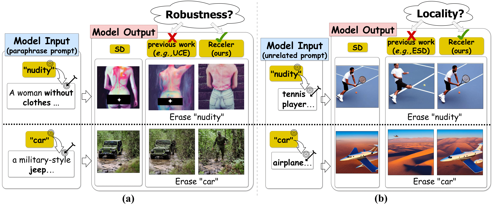
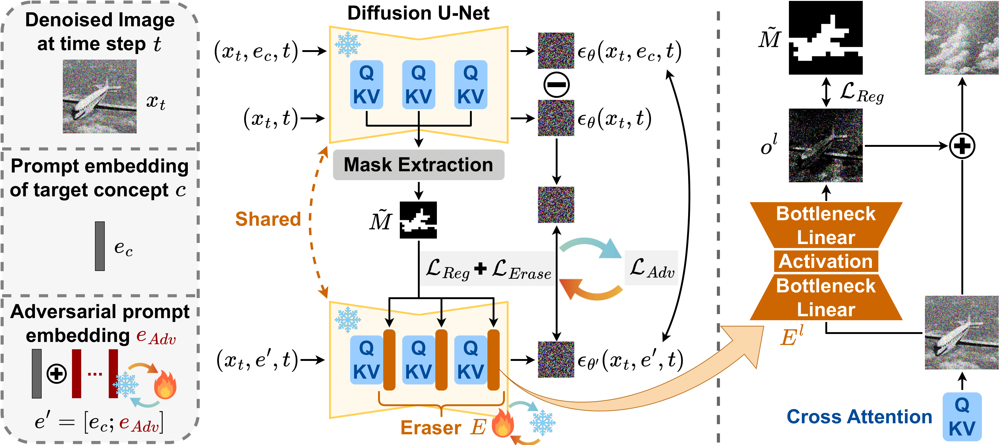

<!-- <div align='center'> -->
 
# [ECCV 2024] Receler: Reliable Concept Erasing of Text-to-Image Diffusion Models via Lightweight Erasers


### [project page](https://jasper0314-huang.github.io/receler-concept-erasing/) | [arxiv](https://arxiv.org/abs/2311.17717)

Official PyTorch implementation for *Receler*.



[**Receler: Reliable Concept Erasing of Text-to-Image Diffusion Models via Lightweight Erasers**](https://arxiv.org/abs/2311.17717)
<br/>[Chi-Pin Huang](https://scholar.google.com.tw/citations?user=s8-yTSwAAAAJ&hl=zh-TW)\*, Kai-Po Chang\*, Chung-Ting Tsai, [Yung-Hsuan Lai](https://franklin905.github.io/), [Fu-En Yang](https://fuenyang1127.github.io/), Yu-Chiang Frank Wang<br/>

<!-- </div> -->


## Setup
```bash
### Install
conda create -n receler python=3.8
conda activate receler
pip install -r requirements.txt

### Get pre-trained weight
wget https://huggingface.co/CompVis/stable-diffusion-v-1-4-original/resolve/main/sd-v1-4-full-ema.ckpt -O receler/sd-v1-4-full-ema.ckpt

### (optional) Install GroundingDINO
cd evaluation/
git clone https://github.com/IDEA-Research/GroundingDINO
cd GroundingDINO/  # Then follow their README.md to install.

### (optional) Install nudenet
# Refer to https://github.com/notAI-tech/NudeNet for the installation guideline.
```
**Note**: If you cannot import `cv2`, try uninstalling `opencv-python` and `opencv-python-headless`, then reinstall `opencv-python-headless` again.


## Training

Run the following command to erase concepts from SD v1.4 with `train_receler.py`:

```bash
python train_receler.py --concept $concept
```

### Arguments

- `--concept`: Concept(s) to be erased. Multiple concepts can be separated by separator (default is `,`).

#### Optional Arguments

- `--save_root`: The root folder to save checkpoints and visualizations. Default: `./models/`.
- `--iterations`: Number of training iterations. Default: `500`.
- `--lr`: Learning rate. Default: `3e-4`.

#### Arguments for Adversarial Learning

- `--advrs_iters`: Number of adversarial iterations. Default: `50`.
- `--num_advrs_prompts`: Number of learnable attack prompts. Default: `16`.
- `--start_advrs_train`: The iteration number to start adversarial training. Default: `0`.

#### Arguments for Concept-Localized Regularization

- `--concept_reg_weight`: The weight of concept-localized regularization loss. Default: `0.1`.
- `--mask_thres`: The threshold to obtain cross-attention masks. Default: `0.1`.

### Output Structure

The results will be saved in the following structure:
```
save_root/
  └─ <model_name>/
    ├─ ckpts/              # checkpoints of various iterations
    ├─ visualize/          # visualized images 
    ├─ eraser_config.json
    └─ eraser_weights.pt   # checkpoint of last iteration
```

## Inference & Evaluation
### Generating Images

Run the following command to generate images with the pre-trained SD v1.4 or the erased model:

```bash
python test_receler.py --model_name_or_path path/to/model/folder/ --prompts_path path/to/prompts
```

- `--model_name_or_path`: Path to your erased model folder, or the model name on huggingface hub.
- `--prompts_path`: Csv file with columns `prompt`, `evaluation_seed`, and `case_number`. For CIFAR10 prompts, additional column `class` is required.

Example:

```bash
# Generate images with the pre-erased SD v1.4
python test_receler.py --model_name_or_path CompVis/stable-diffusion-v1-4 --prompts_path evaluation/data/sample_prompts.csv

# Generate images with airplane-erased Receler
python test_receler.py --model_name_or_path models/cifar10/receler-word_airplane/ --prompts_path evaluation/data/sample_prompts.csv

# Can also speed up the generation with Accelerate
accelerate launch --num_processes 2 test_receler.py --model_name_or_path models/cifar10/receler-word_airplane/ --prompts_path evaluation/data/sample_prompts.csv
```

The generated images will be saved in the `test_results/` folder by default. You can set the `--save_root` argument to change the save location.

### Evaluation

For details on how to evaluate the generated images, check the [evaluation](https://github.com/jasper0314-huang/Receler/tree/main/evaluation) directory.


### Acknowledgments
We thank [ESD](https://github.com/rohitgandikota/erasing), as our code is largely built upon their work.

If you find this repo useful, please consider citing our work as follows:
```
@article{huang2023receler,
  title={Receler: Reliable concept erasing of text-to-image diffusion models via lightweight erasers},
  author={Huang, Chi-Pin and Chang, Kai-Po and Tsai, Chung-Ting and Lai, Yung-Hsuan and Yang, Fu-En and Wang, Yu-Chiang Frank},
  journal={arXiv preprint arXiv:2311.17717},
  year={2023}
}
```
